# Applications Management

[Get free private DeepWikis in Devin](/private-repo)

[DeepWiki](https://deepwiki.com)

[DeepWiki](/)

[rancherlabs/application-collection-extension](https://github.com/rancherlabs/application-collection-extension)

[Get free private DeepWikis with

Devin](/private-repo)Share

Last indexed: 29 July 2025 ([039b43](https://github.com/rancherlabs/application-collection-extension/commits/039b43fd))

* [Overview](/rancherlabs/application-collection-extension/1-overview)
* [Architecture](/rancherlabs/application-collection-extension/2-architecture)
* [User Interface](/rancherlabs/application-collection-extension/3-user-interface)
* [Application Structure](/rancherlabs/application-collection-extension/3.1-application-structure)
* [Authentication and Settings](/rancherlabs/application-collection-extension/3.2-authentication-and-settings)
* [Applications Management](/rancherlabs/application-collection-extension/3.3-applications-management)
* [Workloads Management](/rancherlabs/application-collection-extension/3.4-workloads-management)
* [Helm Operations](/rancherlabs/application-collection-extension/3.5-helm-operations)
* [Client Libraries](/rancherlabs/application-collection-extension/3.6-client-libraries)
* [UI Components and Utilities](/rancherlabs/application-collection-extension/3.7-ui-components-and-utilities)
* [Backend Service](/rancherlabs/application-collection-extension/4-backend-service)
* [Docker Extension Packaging](/rancherlabs/application-collection-extension/5-docker-extension-packaging)
* [Development and Build System](/rancherlabs/application-collection-extension/6-development-and-build-system)
* [Deployment and Release](/rancherlabs/application-collection-extension/7-deployment-and-release)
* [Visual Assets](/rancherlabs/application-collection-extension/8-visual-assets)

Menu

# Applications Management

Relevant source files

* [ui/src/pages/ApplicationDetailsPage/components/BranchesList/BranchCard.tsx](https://github.com/rancherlabs/application-collection-extension/blob/039b43fd/ui/src/pages/ApplicationDetailsPage/components/BranchesList/BranchCard.tsx)
* [ui/src/pages/ApplicationDetailsPage/components/BranchesList/index.tsx](https://github.com/rancherlabs/application-collection-extension/blob/039b43fd/ui/src/pages/ApplicationDetailsPage/components/BranchesList/index.tsx)
* [ui/src/pages/ApplicationDetailsPage/index.tsx](https://github.com/rancherlabs/application-collection-extension/blob/039b43fd/ui/src/pages/ApplicationDetailsPage/index.tsx)
* [ui/src/pages/ApplicationsPage/components/ApplicationCard.tsx](https://github.com/rancherlabs/application-collection-extension/blob/039b43fd/ui/src/pages/ApplicationsPage/components/ApplicationCard.tsx)

This document covers the user interface components responsible for browsing, viewing details, and managing applications from the Rancher application collection. These components handle the display of application metadata, available versions (branches), and provide the interface for initiating application installations.

For information about workload management after installation, see [Workloads Management](/rancherlabs/application-collection-extension/3.4-workloads-management). For Helm installation operations, see [Helm Operations](/rancherlabs/application-collection-extension/3.5-helm-operations). For authentication setup required to access application data, see [Authentication and Settings](/rancherlabs/application-collection-extension/3.2-authentication-and-settings).

## Component Architecture

The applications management interface consists of several React components organized in a hierarchical structure that handles both application listing and detailed views.

### Component Hierarchy



Sources: [ui/src/pages/ApplicationDetailsPage/index.tsx1-106](https://github.com/rancherlabs/application-collection-extension/blob/039b43fd/ui/src/pages/ApplicationDetailsPage/index.tsx#L1-L106) [ui/src/pages/ApplicationsPage/components/ApplicationCard.tsx1-75](https://github.com/rancherlabs/application-collection-extension/blob/039b43fd/ui/src/pages/ApplicationsPage/components/ApplicationCard.tsx#L1-L75) [ui/src/pages/ApplicationDetailsPage/components/BranchesList/index.tsx1-39](https://github.com/rancherlabs/application-collection-extension/blob/039b43fd/ui/src/pages/ApplicationDetailsPage/components/BranchesList/index.tsx#L1-L39) [ui/src/pages/ApplicationDetailsPage/components/BranchesList/BranchCard.tsx1-77](https://github.com/rancherlabs/application-collection-extension/blob/039b43fd/ui/src/pages/ApplicationDetailsPage/components/BranchesList/BranchCard.tsx#L1-L77)

### Data Flow Architecture



Sources: [ui/src/pages/ApplicationDetailsPage/index.tsx20-56](https://github.com/rancherlabs/application-collection-extension/blob/039b43fd/ui/src/pages/ApplicationDetailsPage/index.tsx#L20-L56) [ui/src/pages/ApplicationDetailsPage/components/BranchesList/index.tsx9-38](https://github.com/rancherlabs/application-collection-extension/blob/039b43fd/ui/src/pages/ApplicationDetailsPage/components/BranchesList/index.tsx#L9-L38)

## Application Listing

Application cards are rendered using the `ApplicationCard` component, which displays essential application metadata in a card format suitable for browsing.

### ApplicationCard Structure

| Property | Description | Data Source |
| --- | --- | --- |
| `app.name` | Application display name | `ApplicationReducedViewDTO.name` |
| `app.logo_url` | Application logo image | `ApplicationReducedViewDTO.logo_url` |
| `app.description` | Application description (truncated) | `ApplicationReducedViewDTO.description` |
| `app.packaging_format` | Deployment format (Helm, Container, etc.) | `ApplicationReducedViewDTO.packaging_format` |
| `app.last_updated_at` | Last modification timestamp | `ApplicationReducedViewDTO.last_updated_at` |

The component implements packaging format filtering, where applications with `ApplicationDTOPackagingFormatEnum.Rpm` or undefined packaging formats are marked as "Coming soon" and are not clickable.



Sources: [ui/src/pages/ApplicationsPage/components/ApplicationCard.tsx11-48](https://github.com/rancherlabs/application-collection-extension/blob/039b43fd/ui/src/pages/ApplicationsPage/components/ApplicationCard.tsx#L11-L48)

## Application Details View

The `ApplicationDetailsPage` component provides a comprehensive view of individual applications, including metadata display and available branches for installation.

### Page Loading and Error Handling

The page performs two parallel API calls using the authentication context:

1. `applicationsClient(auth).getApplication(slugName)` - Fetches application metadata
2. `componentsClient(auth).getComponent(slugName)` - Fetches component data including branches



Sources: [ui/src/pages/ApplicationDetailsPage/index.tsx23-56](https://github.com/rancherlabs/application-collection-extension/blob/039b43fd/ui/src/pages/ApplicationDetailsPage/index.tsx#L23-L56)

### Application Header Display

The application header shows the logo, name, and packaging format chip:

* Logo sourced from `https://apps.rancher.io${application.logo_url}`
* Name displayed as `h2` typography variant
* Packaging format shown as a colored chip using `humanFriendlyPackagingFormat()` function

Sources: [ui/src/pages/ApplicationDetailsPage/index.tsx85-99](https://github.com/rancherlabs/application-collection-extension/blob/039b43fd/ui/src/pages/ApplicationDetailsPage/index.tsx#L85-L99)

## Branch Management and Installation

The `BranchesList` component displays available application branches that can be installed as workloads.

### Branch Filtering Logic

Branches are filtered to show only those with artifacts matching the application's packaging format:

```
branches
  .filter(branch => branch.versions?.find(v => v.artifacts.find(a => a.packaging_format === packagingFormat)))
  .flatMap(branch => {
    const version = branch.versions?.find(v => v.artifacts.sort(sortArtifacts).find(a => a.packaging_format === packagingFormat))
    return {
      branch: { name: branch.branch_name, pattern: branch.branch_pattern },
      version: version?.version_number,
      artifact: version?.artifacts.reverse().find(a => a.packaging_format === packagingFormat)
    }
  })
```

Sources: [ui/src/pages/ApplicationDetailsPage/components/BranchesList/index.tsx17-27](https://github.com/rancherlabs/application-collection-extension/blob/039b43fd/ui/src/pages/ApplicationDetailsPage/components/BranchesList/index.tsx#L17-L27)

### BranchCard Component

Each branch is displayed using a `BranchCard` that shows:

| Element | Data Source | Icon |
| --- | --- | --- |
| Version | `version` string | - |
| Branch name | `branch.name` | `GitBranch` |
| Chart version | `artifact.version-artifact.revision` | `LayersOutlined` |
| Last updated | `moment(artifact.registered_at).fromNow()` | `SyncOutlined` |
| Short digest | `artifact.digest.value.substring(0, 7)` | `AdjustOutlined` |

### Installation Flow



The installation process is handled by the `InstallDialog` component (documented in [Helm Operations](/rancherlabs/application-collection-extension/3.5-helm-operations)), which receives the branch name, artifact data, and version information.

Sources: [ui/src/pages/ApplicationDetailsPage/components/BranchesList/BranchCard.tsx11-54](https://github.com/rancherlabs/application-collection-extension/blob/039b43fd/ui/src/pages/ApplicationDetailsPage/components/BranchesList/BranchCard.tsx#L11-L54)

## Data Models and API Integration

### Key Data Transfer Objects

| DTO | Purpose | Key Fields |
| --- | --- | --- |
| `ApplicationDTO` | Full application data | `name`, `description`, `logo_url`, `packaging_format` |
| `ApplicationReducedViewDTO` | Application listing data | Same as ApplicationDTO plus `slug_name`, `last_updated_at` |
| `ComponentDTO` | Component with branches | `branches[]` |
| `BranchDTO` | Branch information | `branch_name`, `branch_pattern`, `versions[]`, `inactive_at` |
| `ArtifactListItemReducedDTO` | Artifact metadata | `version`, `revision`, `digest`, `registered_at`, `packaging_format` |

### API Client Integration

The application management interface integrates with two main backend clients:

* `applicationsClient(auth)` - Handles application metadata requests
* `componentsClient(auth)` - Handles component and branch data requests

Both clients require authentication context and handle HTTP errors with user-friendly error messages that direct users to the settings page for authentication issues.

Sources: [ui/src/pages/ApplicationDetailsPage/index.tsx3-6](https://github.com/rancherlabs/application-collection-extension/blob/039b43fd/ui/src/pages/ApplicationDetailsPage/index.tsx#L3-L6) [ui/src/pages/ApplicationDetailsPage/components/BranchesList/BranchCard.tsx2](https://github.com/rancherlabs/application-collection-extension/blob/039b43fd/ui/src/pages/ApplicationDetailsPage/components/BranchesList/BranchCard.tsx#L2-L2)

Dismiss

Refresh this wiki

Enter email to refresh

### On this page

* [Applications Management](#applications-management)
* [Component Architecture](#component-architecture)
* [Component Hierarchy](#component-hierarchy)
* [Data Flow Architecture](#data-flow-architecture)
* [Application Listing](#application-listing)
* [ApplicationCard Structure](#applicationcard-structure)
* [Application Details View](#application-details-view)
* [Page Loading and Error Handling](#page-loading-and-error-handling)
* [Application Header Display](#application-header-display)
* [Branch Management and Installation](#branch-management-and-installation)
* [Branch Filtering Logic](#branch-filtering-logic)
* [BranchCard Component](#branchcard-component)
* [Installation Flow](#installation-flow)
* [Data Models and API Integration](#data-models-and-api-integration)
* [Key Data Transfer Objects](#key-data-transfer-objects)
* [API Client Integration](#api-client-integration)

Ask Devin about rancherlabs/application-collection-extension

Deep Research