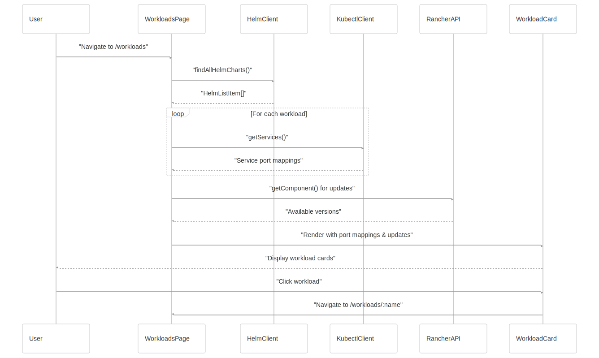

# Workloads Management

[Get free private DeepWikis in Devin](/private-repo)

[DeepWiki](https://deepwiki.com)

[DeepWiki](/)

[rancherlabs/application-collection-extension](https://github.com/rancherlabs/application-collection-extension)

[Get free private DeepWikis with

Devin](/private-repo)Share

Last indexed: 29 July 2025 ([039b43](https://github.com/rancherlabs/application-collection-extension/commits/039b43fd))

* [Overview](/rancherlabs/application-collection-extension/1-overview)
* [Architecture](/rancherlabs/application-collection-extension/2-architecture)
* [User Interface](/rancherlabs/application-collection-extension/3-user-interface)
* [Application Structure](/rancherlabs/application-collection-extension/3.1-application-structure)
* [Authentication and Settings](/rancherlabs/application-collection-extension/3.2-authentication-and-settings)
* [Applications Management](/rancherlabs/application-collection-extension/3.3-applications-management)
* [Workloads Management](/rancherlabs/application-collection-extension/3.4-workloads-management)
* [Helm Operations](/rancherlabs/application-collection-extension/3.5-helm-operations)
* [Client Libraries](/rancherlabs/application-collection-extension/3.6-client-libraries)
* [UI Components and Utilities](/rancherlabs/application-collection-extension/3.7-ui-components-and-utilities)
* [Backend Service](/rancherlabs/application-collection-extension/4-backend-service)
* [Docker Extension Packaging](/rancherlabs/application-collection-extension/5-docker-extension-packaging)
* [Development and Build System](/rancherlabs/application-collection-extension/6-development-and-build-system)
* [Deployment and Release](/rancherlabs/application-collection-extension/7-deployment-and-release)
* [Visual Assets](/rancherlabs/application-collection-extension/8-visual-assets)

Menu

# Workloads Management

Relevant source files

* [ui/src/clients/helm.ts](https://github.com/rancherlabs/application-collection-extension/blob/039b43fd/ui/src/clients/helm.ts)
* [ui/src/pages/WorkloadDetailsPage/index.tsx](https://github.com/rancherlabs/application-collection-extension/blob/039b43fd/ui/src/pages/WorkloadDetailsPage/index.tsx)
* [ui/src/pages/WorkloadsPage/components/WorkloadCard.tsx](https://github.com/rancherlabs/application-collection-extension/blob/039b43fd/ui/src/pages/WorkloadsPage/components/WorkloadCard.tsx)
* [ui/src/pages/WorkloadsPage/index.tsx](https://github.com/rancherlabs/application-collection-extension/blob/039b43fd/ui/src/pages/WorkloadsPage/index.tsx)

This document covers the workload management interface that allows users to view, monitor, and manage deployed Helm releases and Kubernetes services within the SUSE Application Collection Docker Desktop Extension. The workload management system provides real-time status monitoring, port mapping discovery, update detection, and navigation to detailed workload information.

For information about specific Helm operations like installation, upgrading, and uninstallation, see [Helm Operations](/rancherlabs/application-collection-extension/3.5-helm-operations). For general UI structure and routing, see [Application Structure](/rancherlabs/application-collection-extension/3.1-application-structure).

## System Architecture

The workload management system consists of two main pages and supporting components that interact with both Helm releases and Kubernetes services to provide comprehensive workload monitoring.

**Sources:** [ui/src/pages/WorkloadsPage/index.tsx1-170](https://github.com/rancherlabs/application-collection-extension/blob/039b43fd/ui/src/pages/WorkloadsPage/index.tsx#L1-L170) [ui/src/pages/WorkloadDetailsPage/index.tsx1-264](https://github.com/rancherlabs/application-collection-extension/blob/039b43fd/ui/src/pages/WorkloadDetailsPage/index.tsx#L1-L264) [ui/src/pages/WorkloadsPage/components/WorkloadCard.tsx1-121](https://github.com/rancherlabs/application-collection-extension/blob/039b43fd/ui/src/pages/WorkloadsPage/components/WorkloadCard.tsx#L1-L121) [ui/src/clients/helm.ts1-367](https://github.com/rancherlabs/application-collection-extension/blob/039b43fd/ui/src/clients/helm.ts#L1-L367)

## Workload Listing

The `WorkloadsPage` component provides the main interface for viewing all deployed workloads. It fetches Helm releases tagged with the extension identifier and enriches them with Kubernetes service information.

The page implements a state machine with four states: `loading`, `ready`, `error`, and `updating`. Each workload card displays essential information including name, namespace, status, and port mappings.

**Sources:** [ui/src/pages/WorkloadsPage/index.tsx17-27](https://github.com/rancherlabs/application-collection-extension/blob/039b43fd/ui/src/pages/WorkloadsPage/index.tsx#L17-L27) [ui/src/pages/WorkloadsPage/index.tsx128-169](https://github.com/rancherlabs/application-collection-extension/blob/039b43fd/ui/src/pages/WorkloadsPage/index.tsx#L128-L169)

## Workload Details

The `WorkloadDetailsPage` provides comprehensive information about a single workload, including deployment history, configuration details, and available operations.

| Information Type | Data Source | Display Location |
| --- | --- | --- |
| Basic Info | `HelmReleaseDetails` | Header section |
| Port Mappings | Kubernetes Services | Port mappings card |
| Deployment History | Helm history | `HistoryTimeLine` component |
| Release Notes | Helm notes | Notes section |
| Update Status | Rancher Components API | Update button |

The page loads workload details using the `findRelease()` function and enriches the data with Kubernetes service information to display port mappings:

**Sources:** [ui/src/pages/WorkloadDetailsPage/index.tsx28-34](https://github.com/rancherlabs/application-collection-extension/blob/039b43fd/ui/src/pages/WorkloadDetailsPage/index.tsx#L28-L34) [ui/src/pages/WorkloadDetailsPage/index.tsx47-99](https://github.com/rancherlabs/application-collection-extension/blob/039b43fd/ui/src/pages/WorkloadDetailsPage/index.tsx#L47-L99) [ui/src/pages/WorkloadDetailsPage/index.tsx122-263](https://github.com/rancherlabs/application-collection-extension/blob/039b43fd/ui/src/pages/WorkloadDetailsPage/index.tsx#L122-L263)

## Status Management

Workload status is determined by mapping Helm release statuses to simplified display states using the `mapStatus()` function:

| Helm Status | Workload Status | Description |
| --- | --- | --- |
| `deployed`, `superseded` | `Running` | Workload is operational |
| `unknown`, `failed` | `Error` | Workload has issues |
| `uninstalling`, `pending-install`, `pending-upgrade`, `pending-rollback` | `Loading` | Workload is transitioning |
| `uninstalled` | `NotRunning` | Workload is stopped |

The status mapping is implemented in the `mapStatus()` function and used consistently across both the workload list and detail views.

**Sources:** [ui/src/clients/helm.ts73-90](https://github.com/rancherlabs/application-collection-extension/blob/039b43fd/ui/src/clients/helm.ts#L73-L90) [ui/src/clients/helm.ts5-12](https://github.com/rancherlabs/application-collection-extension/blob/039b43fd/ui/src/clients/helm.ts#L5-L12) [ui/src/clients/helm.ts14-26](https://github.com/rancherlabs/application-collection-extension/blob/039b43fd/ui/src/clients/helm.ts#L14-L26)

## Port Mapping Discovery

Port mappings are discovered by querying Kubernetes services associated with each workload. The system filters for `NodePort` services and extracts port information:

This information is displayed in both the workload cards and the detailed view, providing users with immediate access to service endpoints.

**Sources:** [ui/src/pages/WorkloadsPage/index.tsx33-59](https://github.com/rancherlabs/application-collection-extension/blob/039b43fd/ui/src/pages/WorkloadsPage/index.tsx#L33-L59) [ui/src/pages/WorkloadDetailsPage/index.tsx54-69](https://github.com/rancherlabs/application-collection-extension/blob/039b43fd/ui/src/pages/WorkloadDetailsPage/index.tsx#L54-L69) [ui/src/pages/WorkloadsPage/components/WorkloadCard.tsx8-14](https://github.com/rancherlabs/application-collection-extension/blob/039b43fd/ui/src/pages/WorkloadsPage/components/WorkloadCard.tsx#L8-L14)

## Update Detection

The system automatically detects available updates by comparing the current workload version against available versions in the Rancher Components API:

Updates are detected for both same-branch version updates and different-branch updates, with visual indicators displayed on workload cards and detail pages.

**Sources:** [ui/src/pages/WorkloadsPage/index.tsx85-125](https://github.com/rancherlabs/application-collection-extension/blob/039b43fd/ui/src/pages/WorkloadsPage/index.tsx#L85-L125) [ui/src/pages/WorkloadDetailsPage/index.tsx70-98](https://github.com/rancherlabs/application-collection-extension/blob/039b43fd/ui/src/pages/WorkloadDetailsPage/index.tsx#L70-L98) [ui/src/clients/util.ts](https://github.com/rancherlabs/application-collection-extension/blob/039b43fd/ui/src/clients/util.ts)

## Data Flow

The workload management system follows a consistent data flow pattern for both listing and detail views:

This flow ensures that users always see the most current information about their workloads, including real-time status updates and available upgrades.

**Sources:** [ui/src/pages/WorkloadsPage/index.tsx25-83](https://github.com/rancherlabs/application-collection-extension/blob/039b43fd/ui/src/pages/WorkloadsPage/index.tsx#L25-L83) [ui/src/pages/WorkloadDetailsPage/index.tsx36-111](https://github.com/rancherlabs/application-collection-extension/blob/039b43fd/ui/src/pages/WorkloadDetailsPage/index.tsx#L36-L111) [ui/src/clients/helm.ts106-128](https://github.com/rancherlabs/application-collection-extension/blob/039b43fd/ui/src/clients/helm.ts#L106-L128) [ui/src/clients/kubectl.ts](https://github.com/rancherlabs/application-collection-extension/blob/039b43fd/ui/src/clients/kubectl.ts)

Dismiss

Refresh this wiki

Enter email to refresh

### On this page

* [Workloads Management](#workloads-management)
* [System Architecture](#system-architecture)
* [Workload Listing](#workload-listing)
* [Workload Details](#workload-details)
* [Status Management](#status-management)
* [Port Mapping Discovery](#port-mapping-discovery)
* [Update Detection](#update-detection)
* [Data Flow](#data-flow)

Ask Devin about rancherlabs/application-collection-extension

Deep Research