# Helm Operations

[Index your code with Devin](/private-repo)

[DeepWiki](/)

[DeepWiki](/)

[rancherlabs/application-collection-extension](https://github.com/rancherlabs/application-collection-extension "Open repository")

[Index your code with

Devin](/private-repo)Edit WikiShare

Last indexed: 29 July 2025 ([039b43](https://github.com/rancherlabs/application-collection-extension/commits/039b43fd))

* [Overview](/rancherlabs/application-collection-extension/1-overview)
* [Architecture](/rancherlabs/application-collection-extension/2-architecture)
* [User Interface](/rancherlabs/application-collection-extension/3-user-interface)
* [Application Structure](/rancherlabs/application-collection-extension/3.1-application-structure)
* [Authentication and Settings](/rancherlabs/application-collection-extension/3.2-authentication-and-settings)
* [Applications Management](/rancherlabs/application-collection-extension/3.3-applications-management)
* [Workloads Management](/rancherlabs/application-collection-extension/3.4-workloads-management)
* [Helm Operations](/rancherlabs/application-collection-extension/3.5-helm-operations)
* [Client Libraries](/rancherlabs/application-collection-extension/3.6-client-libraries)
* [UI Components and Utilities](/rancherlabs/application-collection-extension/3.7-ui-components-and-utilities)
* [Backend Service](/rancherlabs/application-collection-extension/4-backend-service)
* [Docker Extension Packaging](/rancherlabs/application-collection-extension/5-docker-extension-packaging)
* [Development and Build System](/rancherlabs/application-collection-extension/6-development-and-build-system)
* [Deployment and Release](/rancherlabs/application-collection-extension/7-deployment-and-release)
* [Visual Assets](/rancherlabs/application-collection-extension/8-visual-assets)

Menu

# Helm Operations

Relevant source files

* [ui/src/components/Helm/EditDialog.tsx](https://github.com/rancherlabs/application-collection-extension/blob/039b43fd/ui/src/components/Helm/EditDialog.tsx)
* [ui/src/components/Helm/FilePicker.tsx](https://github.com/rancherlabs/application-collection-extension/blob/039b43fd/ui/src/components/Helm/FilePicker.tsx)
* [ui/src/components/Helm/InstallDialog.tsx](https://github.com/rancherlabs/application-collection-extension/blob/039b43fd/ui/src/components/Helm/InstallDialog.tsx)
* [ui/src/components/Helm/UninstallDialog.tsx](https://github.com/rancherlabs/application-collection-extension/blob/039b43fd/ui/src/components/Helm/UninstallDialog.tsx)
* [ui/src/components/Helm/UpgradeDialog.tsx](https://github.com/rancherlabs/application-collection-extension/blob/039b43fd/ui/src/components/Helm/UpgradeDialog.tsx)

This page documents the user interface components that handle Helm chart operations within the SUSE Application Collection Docker Desktop Extension. These components provide a complete workflow for managing Helm releases including installation, upgrading, editing values, and uninstallation.

For information about the underlying Helm client implementation, see [Client Libraries](/rancherlabs/application-collection-extension/3.6-client-libraries). For workload management and monitoring interfaces, see [Workloads Management](/rancherlabs/application-collection-extension/3.4-workloads-management).

## Overview

The Helm operations system consists of four primary dialog components that handle the complete lifecycle of Helm chart management. Each dialog provides a consistent interface for configuring Helm values and executing operations through the extension's backend services.



Sources: [ui/src/components/Helm/InstallDialog.tsx1-228](https://github.com/rancherlabs/application-collection-extension/blob/039b43fd/ui/src/components/Helm/InstallDialog.tsx#L1-L228) [ui/src/components/Helm/UpgradeDialog.tsx1-191](https://github.com/rancherlabs/application-collection-extension/blob/039b43fd/ui/src/components/Helm/UpgradeDialog.tsx#L1-L191) [ui/src/components/Helm/EditDialog.tsx1-242](https://github.com/rancherlabs/application-collection-extension/blob/039b43fd/ui/src/components/Helm/EditDialog.tsx#L1-L242) [ui/src/components/Helm/UninstallDialog.tsx1-49](https://github.com/rancherlabs/application-collection-extension/blob/039b43fd/ui/src/components/Helm/UninstallDialog.tsx#L1-L49) [ui/src/components/Helm/FilePicker.tsx1-94](https://github.com/rancherlabs/application-collection-extension/blob/039b43fd/ui/src/components/Helm/FilePicker.tsx#L1-L94)

## Installation Workflow

The `InstallDialog` component manages new Helm chart installations from the Rancher application collection. It fetches default values from the backend service and provides interfaces for customization before deployment.



The installation process includes comprehensive error handling and user feedback through the notifications system:

| Operation Stage | Component | Error Handling |
| --- | --- | --- |
| Values Loading | Backend Service | Console error logging with fallback defaults |
| Preflight Checks | `checkDocker`, `checkKubernetes` | User-visible error messages |
| Installation | `installHelmChart` | Progress notifications with success/error states |

Sources: [ui/src/components/Helm/InstallDialog.tsx46-104](https://github.com/rancherlabs/application-collection-extension/blob/039b43fd/ui/src/components/Helm/InstallDialog.tsx#L46-L104) [ui/src/components/Helm/InstallDialog.tsx26-44](https://github.com/rancherlabs/application-collection-extension/blob/039b43fd/ui/src/components/Helm/InstallDialog.tsx#L26-L44)

## Upgrade Operations

The `UpgradeDialog` component handles upgrading existing Helm releases to new chart versions. It retrieves current deployment values and allows modification before applying the upgrade.



The upgrade dialog implements state management to handle loading, configuration, and execution phases. Default values are populated from the backend service endpoint at `/charts/{name}/{version}/local-values`.

Sources: [ui/src/components/Helm/UpgradeDialog.tsx19-47](https://github.com/rancherlabs/application-collection-extension/blob/039b43fd/ui/src/components/Helm/UpgradeDialog.tsx#L19-L47) [ui/src/components/Helm/UpgradeDialog.tsx36-47](https://github.com/rancherlabs/application-collection-extension/blob/039b43fd/ui/src/components/Helm/UpgradeDialog.tsx#L36-L47)

## Values Configuration System

All Helm operation dialogs share a common values configuration system that supports both manual key-value entry and YAML file uploads through the `FilePicker` component.

### Manual Values Entry

The dialogs provide dynamic key-value pair management with add/remove functionality:


Sources: [ui/src/components/Helm/InstallDialog.tsx146-186](https://github.com/rancherlabs/application-collection-extension/blob/039b43fd/ui/src/components/Helm/InstallDialog.tsx#L146-L186) [ui/src/components/Helm/UpgradeDialog.tsx106-149](https://github.com/rancherlabs/application-collection-extension/blob/039b43fd/ui/src/components/Helm/UpgradeDialog.tsx#L106-L149)

### YAML File Processing

The `FilePicker` component processes YAML files by parsing and flattening the structure into key-value pairs:

| Function | Purpose | Implementation |
| --- | --- | --- |
| `onFileChange` | Handle file selection and validation | Checks MIME type for YAML files |
| `flatten` | Convert nested YAML to dot notation | Recursive traversal with array index notation |
| `parse` | YAML parsing | Uses `yaml` library to convert string to object |

The flattening algorithm converts nested structures like `global.imagePullSecrets[0].name` into individual key-value pairs that can be managed through the UI.

Sources: [ui/src/components/Helm/FilePicker.tsx18-74](https://github.com/rancherlabs/application-collection-extension/blob/039b43fd/ui/src/components/Helm/FilePicker.tsx#L18-L74)

## Edit and Uninstall Operations

### Edit Dialog

The `EditDialog` allows modifying values for existing Helm releases without changing the chart version. It uses the same values configuration interface as install and upgrade operations.

### Uninstall Dialog

The `UninstallDialog` provides a confirmation interface requiring users to type the release name to prevent accidental deletions:


Sources: [ui/src/components/Helm/EditDialog.tsx11-152](https://github.com/rancherlabs/application-collection-extension/blob/039b43fd/ui/src/components/Helm/EditDialog.tsx#L11-L152) [ui/src/components/Helm/UninstallDialog.tsx10-49](https://github.com/rancherlabs/application-collection-extension/blob/039b43fd/ui/src/components/Helm/UninstallDialog.tsx#L10-L49)

## Helper Features

### Command Reference

Install, upgrade, and edit dialogs include expandable help sections that provide Helm CLI commands for reference:

```
helm show values oci://dp.apps.rancher.io/charts/{chartName} --version {version}
```

These commands are displayed with copy-to-clipboard functionality for users who want to inspect chart values outside the extension interface.

### Error Display

All dialogs implement consistent error handling with formatted error message display. Multi-line error outputs are split and displayed with console-style formatting using the `code` typography variant.

Sources: [ui/src/components/Helm/UpgradeDialog.tsx190-207](https://github.com/rancherlabs/application-collection-extension/blob/039b43fd/ui/src/components/Helm/UpgradeDialog.tsx#L190-L207) [ui/src/components/Helm/InstallDialog.tsx190-207](https://github.com/rancherlabs/application-collection-extension/blob/039b43fd/ui/src/components/Helm/InstallDialog.tsx#L190-L207) [ui/src/components/Helm/UpgradeDialog.tsx49-78](https://github.com/rancherlabs/application-collection-extension/blob/039b43fd/ui/src/components/Helm/UpgradeDialog.tsx#L49-L78)

Dismiss

Refresh this wiki

Enter email to refresh

### On this page

* [Helm Operations](#helm-operations)
* [Overview](#overview)
* [Installation Workflow](#installation-workflow)
* [Upgrade Operations](#upgrade-operations)
* [Values Configuration System](#values-configuration-system)
* [Manual Values Entry](#manual-values-entry)
* [YAML File Processing](#yaml-file-processing)
* [Edit and Uninstall Operations](#edit-and-uninstall-operations)
* [Edit Dialog](#edit-dialog)
* [Uninstall Dialog](#uninstall-dialog)
* [Helper Features](#helper-features)
* [Command Reference](#command-reference)
* [Error Display](#error-display)

Ask Devin about rancherlabs/application-collection-extension

Fast