# Client Libraries

[Get free private DeepWikis in Devin](/private-repo)

[DeepWiki](https://deepwiki.com)

[DeepWiki](/)

[rancherlabs/application-collection-extension](https://github.com/rancherlabs/application-collection-extension)

[Get free private DeepWikis with

Devin](/private-repo)Share

Last indexed: 29 July 2025 ([039b43](https://github.com/rancherlabs/application-collection-extension/commits/039b43fd))

* [Overview](/rancherlabs/application-collection-extension/1-overview)
* [Architecture](/rancherlabs/application-collection-extension/2-architecture)
* [User Interface](/rancherlabs/application-collection-extension/3-user-interface)
* [Application Structure](/rancherlabs/application-collection-extension/3.1-application-structure)
* [Authentication and Settings](/rancherlabs/application-collection-extension/3.2-authentication-and-settings)
* [Applications Management](/rancherlabs/application-collection-extension/3.3-applications-management)
* [Workloads Management](/rancherlabs/application-collection-extension/3.4-workloads-management)
* [Helm Operations](/rancherlabs/application-collection-extension/3.5-helm-operations)
* [Client Libraries](/rancherlabs/application-collection-extension/3.6-client-libraries)
* [UI Components and Utilities](/rancherlabs/application-collection-extension/3.7-ui-components-and-utilities)
* [Backend Service](/rancherlabs/application-collection-extension/4-backend-service)
* [Docker Extension Packaging](/rancherlabs/application-collection-extension/5-docker-extension-packaging)
* [Development and Build System](/rancherlabs/application-collection-extension/6-development-and-build-system)
* [Deployment and Release](/rancherlabs/application-collection-extension/7-deployment-and-release)
* [Visual Assets](/rancherlabs/application-collection-extension/8-visual-assets)

Menu

# Client Libraries

Relevant source files

* [ui/package.json](https://github.com/rancherlabs/application-collection-extension/blob/039b43fd/ui/package.json)
* [ui/src/clients/backend.ts](https://github.com/rancherlabs/application-collection-extension/blob/039b43fd/ui/src/clients/backend.ts)
* [ui/src/clients/helm.ts](https://github.com/rancherlabs/application-collection-extension/blob/039b43fd/ui/src/clients/helm.ts)
* [ui/src/clients/kubectl.ts](https://github.com/rancherlabs/application-collection-extension/blob/039b43fd/ui/src/clients/kubectl.ts)
* [ui/src/pages/SettingsPage/index.tsx](https://github.com/rancherlabs/application-collection-extension/blob/039b43fd/ui/src/pages/SettingsPage/index.tsx)
* [ui/src/pages/WorkloadsPage/index.tsx](https://github.com/rancherlabs/application-collection-extension/blob/039b43fd/ui/src/pages/WorkloadsPage/index.tsx)

## Purpose and Scope

This document covers the client libraries that enable the React UI to interface with external systems including Helm CLI, kubectl, Docker, and Rancher backend APIs. These libraries abstract the complexity of communicating with different external tools and services, providing typed interfaces for the application components.

For information about the UI components that consume these clients, see [UI Components and Utilities](/rancherlabs/application-collection-extension/3.7-ui-components-and-utilities). For backend service implementation details, see [Backend Service](/rancherlabs/application-collection-extension/4-backend-service).

## Client Library Architecture

The application uses multiple client libraries to interface with different external systems, each serving specific purposes in the workload management workflow.

Sources: [ui/src/clients/helm.ts1-367](https://github.com/rancherlabs/application-collection-extension/blob/039b43fd/ui/src/clients/helm.ts#L1-L367) [ui/src/clients/kubectl.ts1-95](https://github.com/rancherlabs/application-collection-extension/blob/039b43fd/ui/src/clients/kubectl.ts#L1-L95) [ui/src/clients/backend.ts1-64](https://github.com/rancherlabs/application-collection-extension/blob/039b43fd/ui/src/clients/backend.ts#L1-L64) [ui/src/pages/WorkloadsPage/index.tsx1-171](https://github.com/rancherlabs/application-collection-extension/blob/039b43fd/ui/src/pages/WorkloadsPage/index.tsx#L1-L171)

## Docker Desktop Extension API Client

The foundation for all CLI-based operations is the Docker Desktop Extension API client, which provides access to the host system's command-line tools.

| Client Type | Usage | Key Methods |
| --- | --- | --- |
| `createDockerDesktopClient()` | Creates extension API client instance | `extension.host.cli.exec()` |
| Stream-based execution | Real-time command output | `onOutput`, `onError`, `onClose` |

The extension API client enables execution of host CLI commands with streaming output support for long-running operations like Helm installations.

Sources: [ui/package.json10](https://github.com/rancherlabs/application-collection-extension/blob/039b43fd/ui/package.json#L10-L10) [ui/src/clients/helm.ts1-4](https://github.com/rancherlabs/application-collection-extension/blob/039b43fd/ui/src/clients/helm.ts#L1-L4)

## CLI-based Clients

### Helm Client Operations

The Helm client provides comprehensive lifecycle management for Helm charts through CLI command execution.

Key Helm client functions include:

* **Authentication**: `helmLogin()` and `helmLogout()` manage registry authentication for `dp.apps.rancher.io/charts`
* **Discovery**: `findAllHelmCharts()` lists releases with the `source=application-collection-extension` label
* **Installation**: `installHelmChart()` deploys OCI charts with streaming output and custom values
* **Management**: `upgradeHelmChart()` and `editHelmChart()` modify existing releases
* **Cleanup**: `uninstallHelmChart()` removes releases with wait confirmation

Sources: [ui/src/clients/helm.ts92-367](https://github.com/rancherlabs/application-collection-extension/blob/039b43fd/ui/src/clients/helm.ts#L92-L367)

### Kubectl Client Operations

The kubectl client manages Kubernetes cluster interactions and authentication.

| Function | Purpose | CLI Command |
| --- | --- | --- |
| `checkKubernetes()` | Verify cluster connectivity | `kubectl get nodes` |
| `kubernetesLogin()` | Create image pull secret | `kubectl create secret docker-registry` |
| `kubernetesLogout()` | Remove authentication secret | `kubectl delete secret` |
| `findKubernetesSecret()` | Verify secret existence | `kubectl get secret` |
| `getServices()` | Retrieve services by labels | `kubectl get services -l` |
| `getContexts()` | List available contexts | `kubectl config get-contexts` |
| `useContext()` | Switch active context | `kubectl config use-context` |

Sources: [ui/src/clients/kubectl.ts4-95](https://github.com/rancherlabs/application-collection-extension/blob/039b43fd/ui/src/clients/kubectl.ts#L4-L95)

## HTTP-based Clients

### Rancher Backend API Clients

The backend clients provide typed interfaces to Rancher's REST APIs using generated TypeScript clients.

The backend clients are generated from OpenAPI specifications and provide type-safe access to Rancher's application collection APIs. Each client factory function accepts an authentication string and returns a configured API client instance.

Sources: [ui/src/clients/backend.ts33-63](https://github.com/rancherlabs/application-collection-extension/blob/039b43fd/ui/src/clients/backend.ts#L33-L63) [ui/package.json34](https://github.com/rancherlabs/application-collection-extension/blob/039b43fd/ui/package.json#L34-L34)

## Authentication and Configuration

### Authentication Flow

Authentication is handled differently across client types:

* **CLI Clients**: Use credential injection through Docker Desktop Extension API
* **HTTP Clients**: Use Basic Authentication with Base64-encoded credentials
* **Registry Access**: Separate authentication for Helm registry and Docker registry

Sources: [ui/src/clients/backend.ts13-31](https://github.com/rancherlabs/application-collection-extension/blob/039b43fd/ui/src/clients/backend.ts#L13-L31) [ui/src/clients/helm.ts92-104](https://github.com/rancherlabs/application-collection-extension/blob/039b43fd/ui/src/clients/helm.ts#L92-L104) [ui/src/clients/kubectl.ts17-24](https://github.com/rancherlabs/application-collection-extension/blob/039b43fd/ui/src/clients/kubectl.ts#L17-L24)

### Configuration Management

Client configuration varies by environment and authentication requirements:

* **Base Path Configuration**: Production uses `https://api.apps.rancher.io`, development uses `http://localhost:3000/api`
* **Retry Logic**: Axios retry configuration with exponential backoff for network errors and 5xx responses
* **Request Interception**: Automatic Basic Authentication header injection for authenticated requests

Sources: [ui/src/clients/backend.ts6-31](https://github.com/rancherlabs/application-collection-extension/blob/039b43fd/ui/src/clients/backend.ts#L6-L31)

## Error Handling and Retry Logic

### HTTP Client Error Handling

The HTTP clients implement comprehensive error handling with retry capabilities:

| Feature | Implementation | Configuration |
| --- | --- | --- |
| Automatic Retry | `axios-retry` integration | 1 retry on network/5xx errors |
| Error Logging | Request attempt logging | URL, attempt count, error details |
| Authentication | Basic Auth header injection | Base64 encoding of credentials |

### CLI Client Error Handling

CLI-based operations use Promise-based error handling with specific error types:

* **Command Not Found**: Rejects with tool requirement messages
* **Exit Code Handling**: Streams capture stdout/stderr for detailed error reporting
* **Timeout Management**: Long-running operations use streaming with close callbacks

Sources: [ui/src/clients/backend.ts22-28](https://github.com/rancherlabs/application-collection-extension/blob/039b43fd/ui/src/clients/backend.ts#L22-L28) [ui/src/clients/helm.ts244-265](https://github.com/rancherlabs/application-collection-extension/blob/039b43fd/ui/src/clients/helm.ts#L244-L265)

Dismiss

Refresh this wiki

Enter email to refresh

### On this page

* [Client Libraries](#client-libraries)
* [Purpose and Scope](#purpose-and-scope)
* [Client Library Architecture](#client-library-architecture)
* [Docker Desktop Extension API Client](#docker-desktop-extension-api-client)
* [CLI-based Clients](#cli-based-clients)
* [Helm Client Operations](#helm-client-operations)
* [Kubectl Client Operations](#kubectl-client-operations)
* [HTTP-based Clients](#http-based-clients)
* [Rancher Backend API Clients](#rancher-backend-api-clients)
* [Authentication and Configuration](#authentication-and-configuration)
* [Authentication Flow](#authentication-flow)
* [Configuration Management](#configuration-management)
* [Error Handling and Retry Logic](#error-handling-and-retry-logic)
* [HTTP Client Error Handling](#http-client-error-handling)
* [CLI Client Error Handling](#cli-client-error-handling)

Ask Devin about rancherlabs/application-collection-extension

Deep Research